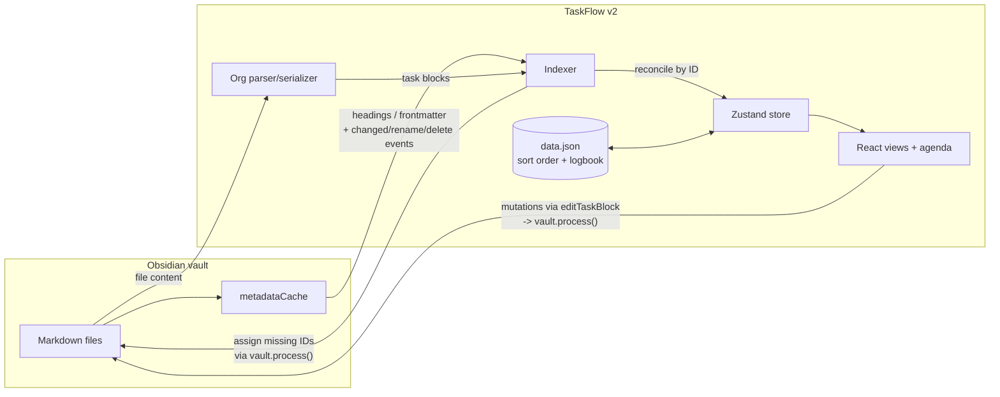

# TaskFlow v2

An Obsidian plugin that turns your vault into an Org Mode task manager. Tasks are plain markdown list items carrying Org's own syntax — TODO keywords, `[#A]` priority cookies, `SCHEDULED:`/`DEADLINE:` planning lines, `:tag:` lists, and `PROPERTIES`/`LOGBOOK` drawers — and the plugin gives you a real **org-agenda** over them, plus Inbox / Next / Waiting / Whenever / Someday / History views.

**Markdown is the source of truth.** The plugin's persisted index only owns manual sort order, completion history, and repeat bookkeeping — deleting `data.json` loses nothing else.

> Coming from TaskFlow v1? Run **Migrate from TaskFlow v1: preview changes (dry run)**, read the report, then **convert vault…**. Your task IDs, history, and sort order carry over untouched. See [Migrating from v1](#migrating-from-v1).

## Quick install

No build tools needed — the plugin is three files in your vault:

```bash
VAULT="/path/to/your/vault"
mkdir -p "$VAULT/.obsidian/plugins/taskflow-v2" && cd "$VAULT/.obsidian/plugins/taskflow-v2"
for f in main.js manifest.json styles.css; do
  curl -LO "https://github.com/jamesmcculley/taskflow-v2/releases/latest/download/$f"
done
```

Or download `main.js`, `manifest.json`, and `styles.css` from the [latest release](https://github.com/jamesmcculley/taskflow-v2/releases/latest) by hand into that folder.

Then:

1. **Fully quit and reopen Obsidian.** It caches the plugin manifest list at launch, so a folder that appeared while it was running stays invisible until a restart.
2. **Settings → Community plugins** → turn off Restricted mode → enable **TaskFlow v2**.
3. Run **TaskFlow: Open agenda** (Cmd/Ctrl+P).

**Coming from v1?** Copy your index across before first launch, so manual sort order, completion timestamps, History, and saved filters carry over — task IDs are unchanged by the migration, so they all still resolve:

```bash
cp "$VAULT/.obsidian/plugins/taskflow/data.json" "$VAULT/.obsidian/plugins/taskflow-v2/data.json"
```

### Installing from source

Building it yourself instead (and what to use on a dev machine) — point `.env` at your vault via `TEST_VAULT_PATH`, see `.env.example`:

```bash
npm install
npm run setup:vault          # add --enable to also switch it on, with Obsidian quit
```

That builds, copies the three files in, and seeds `data.json` from v1 if v2 doesn't have one yet — never overwriting an existing v2 `data.json`. After the first install you don't need to restart Obsidian again: `npm run build` copies into the vault on its own, and the **reload button in the sidebar footer** picks the new build up in place.

v2 installs alongside v1 (different plugin ID), and both can be enabled at once while you migrate. They index the same vault in different syntaxes and won't fight over the same lines — a converted task is invisible to v1, and an unconverted one is invisible to v2 — and since v2.0.0 they no longer collide on Obsidian view ids or CSS class names either.

## Conventions

A task is a list item whose first word is a TODO keyword. Everything below it, up to the end of its drawers, belongs to that task:

```markdown
- TODO [#A] Set up staging server :dev: ^t-a1b2c3
  DEADLINE: <2026-07-28 Tue> SCHEDULED: <2026-07-21 Tue 09:30 ++1w>
  :PROPERTIES:
  :EFFORT: 2h
  :END:

- DONE Audit current site :research: ^t-d4e5f6
  CLOSED: [2026-07-15 Wed 14:32]
```

| Syntax | Meaning |
| --- | --- |
| `TODO` | Open, not started |
| `NEXT` | The next action — gets its own list and sorts above plain TODOs |
| `WAITING` | Blocked or delegated — its own list, sorts below TODOs |
| `SOMEDAY` | Deferred; kept off the agenda entirely |
| `DONE` / `CANCELLED` | Finished / abandoned |
| `[#A]` `[#B]` `[#C]` | Priority cookie — sorts above manual order |
| `SCHEDULED: <2026-07-21 Tue>` | When you plan to start; drives the agenda |
| `SCHEDULED: <2026-07-21 Tue 09:30>` | With a time — the agenda sorts the day chronologically |
| `SCHEDULED: <2026-07-21 Tue 09:30-10:15>` | With a time range |
| `DEADLINE: <2026-07-28 Tue>` | Hard deadline; appears in the agenda ahead of time |
| `CLOSED: [2026-07-15 Wed 14:32]` | Completion stamp, written by the plugin |
| `+1w` `++1w` `.+1w` | Repeaters on a stamp — see [Repeats](#repeats) |
| `:work:urgent:` | Tags, at the end of the headline |
| `:someday:` | v1's task-level Someday — still read, but `SOMEDAY` is the keyword to write |
| `:tonight:` | Sorts to a Tonight section under today in the agenda |
| `^t-a1b2c3` | Stable ID, assigned by the plugin on first index |

**The headline is a list item.** Bare `TODO …` lines parse fine too, but consecutive unindented lines collapse into one paragraph in markdown, which would run the planning line onto the headline in reading view. Writing tasks as list items keeps the planning line and drawers rendering as part of the same item. The parser accepts both, so hand-written or pasted org indexes either way.

**Checklists.** A plain `- [ ]` checkbox indented under a task is a checklist item of that task: it shows as an `n/m` progress chip and expands inline when the task is selected. A *nested keyword headline* is never a checklist item — in Org a subtree with its own TODO is its own task, and it indexes as one.

**Where the ID lives.** By default the stable ID rides on the headline as `^t-xxxxxx`, which doubles as a working Obsidian block link (`[[Note#^t-a1b2c3]]`). Settings → **Task ID style** switches to Org's own `:ID:` property instead; that costs three lines per task and gives up the linkable anchor, but it's what plain Org writes. Both forms are always read, and a drawer `:ID:` wins over a block ref if a task somehow carries both.

**Excluding content** that isn't a task:

- One note: add `taskflow: false` (or `ignore`) to the frontmatter.
- Whole folders: list them under **Settings → Excluded folders**.

There's no per-headline opt-out, because a v2 task needs an explicit TODO keyword — an ordinary checkbox or a plain list item is never indexed, so there's nothing to opt out of. (v1 needed one: every checkbox in the vault was a task.)

Project membership: a task belongs to the note it lives in when that note has `type: project` frontmatter (`status: active | someday | done`). Tasks anywhere else — `Inbox.md`, daily notes, ordinary notes — are Inbox items. The markdown heading enclosing a task is its section heading.

## The agenda

The agenda is v2's primary view: a window of days, each listing the tasks whose `SCHEDULED` or `DEADLINE` stamp lands them there. It follows Org's rules:

- A **scheduled** task shows on its day, and — with *Carry past scheduled items forward* on (default) — on every day after until it's done, prefixed `Sched. 3x` to say how long it's been sitting there. This is what stops an overdue task from quietly disappearing.
- A **deadline** shows from *Deadline warning days* before it (default 14) up to the day itself, prefixed `In 4 d.` / `Deadline`, and every day after while it's open, prefixed `3 d. ago`.
- A task with **both** stamps appears twice on a day, once per reason — that repetition is the point, since the two mean different things.
- Timed items lead each day in clock order; untimed ones follow, overdue deadlines first.
- `SOMEDAY` tasks and finished tasks never appear.

The toolbar steps the window back and forward, jumps home to today, and switches span between day / 3 days / week / fortnight. Defaults for span, deadline warning, and carry-forward live in settings.

**The dispatcher** (`Agenda dispatcher…`) is Org's `C-c a`: type a single key to jump to a view — `a` weekly agenda, `d` today, `w` fortnight, `t` unscheduled tasks, `n` NEXT actions, `W` waiting, `i` inbox, `s` someday, `l` history, `R` review. The keys match Org's own where Org has one.

## Views (the sidebar)

**Agenda** leads the nav and is the only dated view: today, overdue, and everything ahead, windowed by span (`D` / `3D` / `W` / `F`). Today's block carries the two things a separate Today list used to: a **→ Today** button when anything is overdue, and a **🌙 Tonight** section for `:tonight:` tasks. Then the fixed lists, then Areas with their projects (progress pies included):

- **Inbox** — a triage holding area: open tasks outside any project note with no `SCHEDULED` or `DEADLINE` stamp. It's not tied to a location — planning a task or filing it into a project/Someday removes it automatically; clearing that stamp or removing it from a project puts it right back, so nothing gets lost by editing. Completing or cancelling removes it for good.
- **Next** — everything marked `NEXT`. The actionable shortlist.
- **Waiting** — everything marked `WAITING`: what's parked on someone else.
- **Whenever** — open tasks in active projects with no scheduled date.
- **Someday** — `SOMEDAY` tasks, `:someday:`-tagged tasks, and tasks in `status: someday` projects.
- **History** — completed/cancelled tasks from the index completion log, grouped by day, newest first. Right-click any completion for **Edit date…** if it was logged on the wrong day — it corrects the log entry, moves its daily-note journal line, and (if the task still shows that `CLOSED` stamp) corrects the stamp too. Completions are picked up no matter how they happened — clicking the checkbox in the sidebar, hand-typing `DONE`, or a change synced in from elsewhere: the indexer notices any done/cancelled task with no History entry yet, adds a `CLOSED` stamp if it's missing one, and logs it using that stamp's date. Editing a `CLOSED` date by hand syncs History to match on the next reindex, since markdown is always the source of truth.
- **Projects** — under collapsible Area headers (`area: <name>` frontmatter) or standalone; each project view groups tasks by heading, with task-level Someday items dimmed at the bottom. **Areas are clickable** — an area header opens a view of all its projects' open tasks.
- **Review** — look back and ahead over a **week, month or quarter**. The look-back is built from the completion log and grouped by area, then project. Star anything worth remembering and it becomes a *highlight*; highlights carry upward, so the month shows its weeks' and the quarter shows its months' and weeks'. **Write review note** renders the whole thing — highlights, the by-area breakdown with counts, what you're aiming at next, and your own notes — as a plain markdown file in your review folder. Nothing in it depends on the plugin, so it can be copied straight out.
- **Quick search** — fuzzy search across lists, filters, areas, projects, and open tasks.

In the narrow right sidebar the nav collapses behind a menu button; opened as a workspace tab it becomes a two-pane sidebar + content layout.

Every task shows its **TODO keyword as a clickable pill** — clicking cycles TODO → NEXT → WAITING. A **source chip** (`#Note Name`) names the note it lives in, hidden inside that note's own project view where it would just repeat.

Other interactions carried over from v1: click selects, double-click (or Enter) opens the note at the line, ↑/↓ move the selection, Space completes; drag and drop reorders within a list and persists in the index (never in your markdown); and the floating ＋ button captures into the current context.

## Repeats

Org's repeaters live on the `SCHEDULED` (or `DEADLINE`) stamp, and the three kinds mean different things:

| Repeater | Behaviour |
| --- | --- |
| `+1w` | Shift once from the stamp. A month-overdue weekly task steps forward exactly one week per completion. |
| `++1w` | Shift by whole weeks until strictly after today — catches up but stays on the original weekday. |
| `.+1w` | One week from *today*, ignoring the old stamp. The "after completion" variant. |

Units are `d` days, `w` weeks, `m` months, `y` years. Month arithmetic clamps to the end of a short month (Jan 31 `+1m` → Feb 28).

Completing a repeating task rewrites its headline back to its open keyword with the stamps advanced, appends a `State "DONE" from "TODO" [stamp]` line to its `:LOGBOOK:` drawer, and records the occurrence in the index log. When both stamps exist, `DEADLINE` keeps its offset from `SCHEDULED`.

**Patterns no repeater expresses** — "every 3rd friday", "every weekday", "every monday" — keep an rrule phrase in a `:REPEAT:` property instead, and the completion path falls back to rrule for exactly those. The v1 migration writes this automatically where it has to.

## Quick capture

`TaskFlow: Quick capture` opens a one-line modal with a live preview of the exact block it will write:

```
NEXT Buy paint tomorrow #home !due friday >Home Renovation
```

- A leading TODO keyword (`NEXT`, `WAITING`, …) sets the keyword; otherwise it's `TODO`.
- Free text becomes the title; the first natural-language date (via chrono) becomes `SCHEDULED` — with a time (`tomorrow at 9:30`) when you give one.
- `!due <date>` sets `DEADLINE` (natural language works too).
- `>Project Name` files the task into a matching project (exact → prefix → substring); otherwise it goes to `Inbox.md`.
- `every …` phrases become a repeater (`every 2 weeks after done` → `.+2w`), or a `:REPEAT:` property when no repeater fits. Since Org has no dateless repeater, a repeat typed without a date is scheduled today.
- `[#A]` or `!!!`/`!!`/`!` set priority; `#tags` become the org tag list.

## Commands

All hotkey-bindable: **Open agenda**, **Open sidebar**, **Agenda dispatcher…**, **Quick capture**, **Quick search**, **Open review**, **Roll all overdue tasks to today**, the two **migration** commands, and editor commands acting on the task at the cursor — cycle keyword, set keyword…, complete/uncomplete, cancel, cycle priority, tonight, someday, schedule today, schedule pick…, set deadline, clear scheduled date, move to project.

Editor commands resolve the task the cursor is *inside*, not just the headline — anywhere in a task's block counts, since a v2 task spans several lines.

The **When…** / **Deadline…** pickers accept natural language (`friday`, `aug 3`, `in 2 weeks`, `yesterday`) and offer Today / Tomorrow / Next week / Clear date.

## Pinned filters

Saved smart lists, pinned to the sidebar with live counts: name + any combination of tags (all must match; nested tags match by prefix), TODO keywords, project, area, date window (overdue / today / this week / no date / has date), and title text. Filters match open tasks, combine criteria with AND, and are editable/deletable via right-click.

## Daily-note sync

When enabled (default), completing a task appends a journal line to that day's daily note under a configurable heading (default `## Completed`):

```markdown
- ✅ 14:32 Send weekly email ([[Website Redesign]]) %%t-a1b2c3%%
```

Lines are plain list items (not tasks) so the indexer ignores them; the `%%id%%` comment is invisible in preview and lets uncompleting remove the exact line — even days later, from the right note. Folder and filename format come from the Daily Notes core plugin.

Every path that removes a completion from History also removes its journal line. If you're carrying drift from before that guarantee existed, run **Clean up daily-note lines with no matching History entry** once to repair it.

## Migrating from v1

Two commands, in this order:

1. **Migrate from TaskFlow v1: preview changes (dry run)** — scans the vault, writes nothing, and opens `TaskFlow migration dry run.md`: counts, every planned before/after diff, every repeat that needs the `:REPEAT:` fallback, and every file skipped and why.
2. **Migrate from TaskFlow v1: convert vault…** — shows a confirmation modal with the same summary and a sample, then converts. Every file it touches is first copied into `TaskFlow v1 backup <timestamp>/` inside the vault, mirroring the original folder structure.

What the converter does, token for token:

| v1 | v2 |
| --- | --- |
| `- [ ]` / `- [x]` / `- [-]` | `TODO` / `DONE` / `CANCELLED` |
| `!!!` / `!!` | `[#A]` / `[#B]` |
| `⏳ 2026-07-21 09:30` | `SCHEDULED: <2026-07-21 Tue 09:30>` |
| `📅 2026-07-28` | `DEADLINE: <2026-07-28 Tue>` |
| `✅ 2026-07-15` | `CLOSED: [2026-07-15 Wed 00:00]` |
| `🔁 every week` | `++1w` on the `SCHEDULED` stamp |
| `🔁 every 2 weeks after done` | `.+2w` |
| `🔁 every 3rd friday` | `:REPEAT: every 3rd friday` (no repeater fits) |
| `🌙` | the `:tonight:` tag |
| `#tag` | the org tag list, `:tag:` |
| `^t-a1b2c3` | kept as-is (or moved to `:ID:` per your ID style) |

Guarantees worth knowing:

- **Task IDs never change.** That's what lets your existing `data.json` — manual sort order, completion timestamps, the History log, saved filters — carry over untouched. Copy it from `plugins/taskflow/data.json` to `plugins/taskflow-v2/data.json` and everything resolves.
- **Checklist items are left alone.** A checkbox nested under a task is a checklist item in both versions, so it keeps its `^id` and its identity.
- **Non-task content is byte-for-byte untouched**, including CRLF line endings, tables, and prose containing dashes or brackets.
- **It's idempotent.** Re-running over a converted or partly-converted vault is a no-op on the converted parts, so an interrupted migration is safe to resume.
- `✅` carried no time in v1, so converted `CLOSED` stamps read `00:00`. The index keeps the real completion timestamp, and History reads from that — nothing is lost.

## Architecture

```
src/
  main.ts        Plugin entry: lifecycle, commands, view + hover-source registration
  settings.ts    Settings tab + persisted data shape (settings, sort order, completion log)
  types.ts       Task model shared by all layers
  org/           The Org layer: keywords, timestamps, block parser, serializer, tags
  indexer/       Markdown -> Task[]: vault scanner, ID assignment
  migrate/       v1 tokenizer + converter + vault migrator with backups
  mutations/     Task actions (parse -> mutate -> re-emit) + block insert/extract helpers
  store/         Zustand store (task map) + pure derived selectors + agenda builder
  views/         React app hosted in an Obsidian ItemView
```

### The block model

The single biggest change from v1. A v1 task was one line, so every mutation was a regex patch on that line. A v2 task is a **block**: a headline, an optional planning line, and optional `PROPERTIES`/`LOGBOOK` drawers. So every mutation instead goes through `editTaskBlock`:

```
parse the block  ->  mutate the parsed object  ->  re-emit it  ->  splice it back
```

That keeps the block canonical (planning line before drawers, Org's `CLOSED`/`DEADLINE`/`SCHEDULED` key order, drawers dropped when empty) with no per-token string surgery, and it never touches a line outside the block. The block deliberately ends at the last contiguous drawer — a drawer separated by a blank line, or an unterminated one, is treated as prose and left alone rather than absorbed.

### Data flow



- **Indexer** does a full-vault scan on load. Unlike v1 it can't ask the metadataCache "does this file have checkboxes?" — keyword headlines aren't cached — so every candidate file is read through `cachedRead` (served from memory) behind a cheap regex pre-filter. Incremental updates come from `metadataCache.on('changed')`, debounced 250 ms per file. Tasks are reconciled by ID; missing IDs are written back (batched per file, bottom-up so line numbers stay valid) through `vault.process()`.
- **Store** holds the task map; views subscribe through pure selectors (`buildAgenda`, `selectByKeyword`, `selectTodayTasks`, …). All mutations flow through store actions.
- **Views** are a single registered `ItemView` hosting a React 18 app with an internal router.

Performance targets: full reindex of 2,000 tasks < 500 ms, incremental file update < 10 ms. Enable "Debug performance logging" in settings to see timings in the console.

## Development

```bash
npm install
npm run dev        # esbuild watch mode -> main.js
npm run build      # typecheck + production build
npm run test       # vitest unit tests
npm run lint       # eslint
```

Manual testing against a vault:

```bash
cp .env.example .env    # set TEST_VAULT_PATH (defaults to ./test-vault)
npm run seed            # copy the v2 (org) fixtures into the vault
npm run seed:v1         # copy the v1 (emoji) fixtures instead, to test migration
npm run build           # builds AND copies the plugin into the vault
npm run setup:vault     # build + copy + seed data.json from v1 (--enable to switch it on)
```

`test-vault/seed-v1/` holds the original v1 fixtures and `test-vault/seed/` holds the same content converted — generated by running the real converter over them, so the two directories double as a migration fixture pair.

**Reload during development**: with `npm run dev` running, every source save rebuilds and copies into the vault; click the ⟳ button next to the version in the sidebar footer to reload the plugin.

## Conventions for contributors

- TypeScript strict mode; `npm run typecheck && npm run lint && npm run test && npm run build` must pass before every commit.
- `main.js` is a build artifact and stays out of git.
- Every CSS class, custom property, and keyframe name is prefixed `tf2-`, and anything registered into an Obsidian-wide registry (view types, hover sources) is prefixed `taskflow-v2`. v1 and v2 run side by side during a migration and share one global stylesheet and one view registry, so a `taskflow-`prefixed name is a live collision — `tests/namespacing.test.ts` fails the build on one.
- `src/org/`, `src/migrate/convert.ts`, and the selectors are pure modules with no `obsidian` imports, so they unit-test without mocks. Keep it that way — the tag/property constants live in `src/org/tags.ts` rather than the indexer for exactly this reason.
- Non-obvious choices are logged in [DECISIONS.md](DECISIONS.md).
